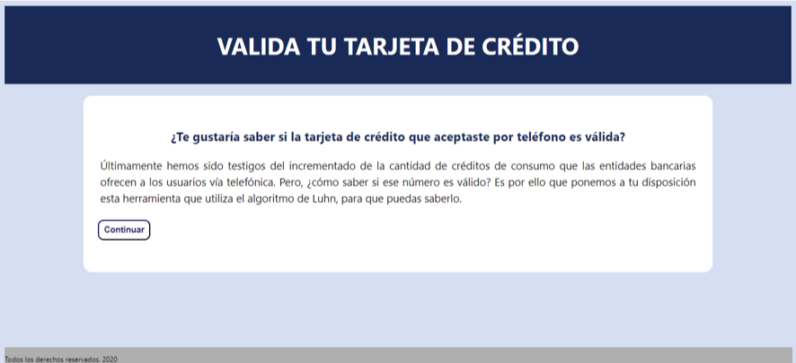
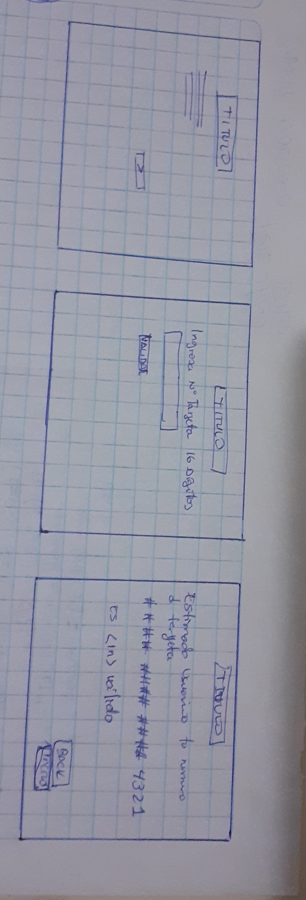
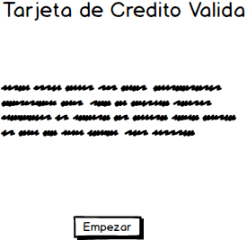
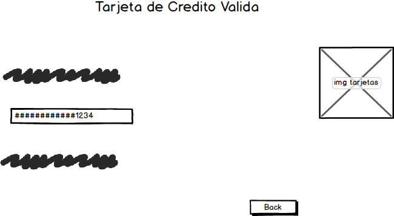

# Tarjeta de crédito válida

## Índice

* [1. Preámbulo](#1-preámbulo)
* [2. Resumen del proyecto](#2-resumen-del-proyecto)
* [3. Objetivos de aprendizaje](#3-objetivos-de-aprendizaje)
* [4. Consideraciones generales](#4-consideraciones-generales)
* [5. Criterios de aceptación mínimos del proyecto](#5-criterios-de-aceptación-mínimos-del-proyecto)
* [6. Consideraciones técnicas](#6-consideraciones-técnicas)
* [7. Pistas, tips y lecturas complementarias](#7-pistas-tips-y-lecturas-complementarias)

***

## 1. Preámbulo

El [algoritmo de Luhn](https://es.wikipedia.org/wiki/Algoritmo_de_Luhn),
también llamado algoritmo de módulo 10, es un método de suma de verificación,
se utiliza para validar números de identificación; tales como el IMEI de los
celulares, tarjetas de crédito, etc.

Este algoritmo es simple. Obtenemos la reversa del número a verificar (que
solamente contiene dígitos [0-9]); a todos los números que ocupan una posición
par se les debe multiplicar por dos, si este número es mayor o igual a 10,
debemos sumar los dígitos del resultado; el número a verificar será válido si
la suma de sus dígitos finales es un múltiplo de 10.


## 2. Resumen del proyecto

En este proyecto tendrás que construir una aplicación web que le permita a un
usuario validar el número de una tarjeta de crédito. Además, tendrás que
implementar funcionalidad para ocultar todos los dígitos de una tarjeta menos
los últimos cuatro.

La temática es libre. Tú debes pensar en qué situaciones de la vida real se
necesitaría validar una tarjeta de crédito y pensar en cómo debe ser esa
experiencia de uso (qué pantallas, explicaciones, mensajes, colores, ¿marca?)
etc.

## 3. Objetivos de aprendizaje

El objetivo principal de aprendizaje es adquirir experiencia desarrollando
aplicaciones web (WebApp) que interactúen con el usuario a través del navegador
y la lógica, utilizando HTML, CSS y JavaScript como herramientas.

Reflexiona y luego marca los objetivos que has llegado a **entender** y
**aplicar** en tu proyecto.

### UX

* [✓] [Diseñar la aplicación pensando y entendiendo al usuario](https://lms.laboratoria.la/cohorts/lim-2020-01-bc-core-lim012/courses/intro-ux/01-el-proceso-de-diseno/00-el-proceso-de-diseno)
* [✓] [Crear prototipos para obtener feedback e iterar](https://lms.laboratoria.la/cohorts/lim-2020-01-bc-core-lim012/courses/product-design/00-sketching/00-sketching)
* [ ] [Aplicar los principios de diseño visual](https://lms.laboratoria.la/cohorts/lim-2020-01-bc-core-lim012/courses/product-design/01-visual-design/01-visual-design-basics)

### HTML y CSS

* [✓] [Uso correcto de HTML semántico](https://developer.mozilla.org/en-US/docs/Glossary/Semantics#Semantics_in_HTML)
* [✓] [Uso de selectores de CSS](https://developer.mozilla.org/es/docs/Web/CSS/Selectores_CSS)
* [✓] [Construir tu aplicación respetando el diseño realizado](https://lms.laboratoria.la/cohorts/lim-2020-01-bc-core-lim012/courses/css/01-css/02-boxmodel-and-display) (maquetación).

### DOM

* [✓] [Uso de selectores de nodos del DOM](https://lms.laboratoria.la/cohorts/lim-2020-01-bc-core-lim012/courses/browser/02-dom/03-1-dom-methods-selection)
* [✓] [Manejo de eventos del DOM](https://lms.laboratoria.la/cohorts/lim-2020-01-bc-core-lim012/courses/browser/02-dom/04-events)
* [✓] [Manipulación dinámica del DOM](https://developer.mozilla.org/es/docs/Referencia_DOM_de_Gecko/Introducci%C3%B3n)

### Javascript

* [✓] [Manipulación de strings](https://lms.laboratoria.la/cohorts/lim-2020-01-bc-core-lim012/courses/javascript/06-strings/01-strings)
* [✓] [Uso de condicionales](https://lms.laboratoria.la/cohorts/lim-2020-01-bc-core-lim012/courses/javascript/02-flow-control/01-conditionals-and-loops)
* [✓] [Uso de bucles](https://lms.laboratoria.la/cohorts/lim-2020-01-bc-core-lim012/courses/javascript/02-flow-control/02-loops)
* [✓] [Uso de funciones](https://lms.laboratoria.la/cohorts/lim-2019-09-bc-core-lim011/courses/javascript/02-flow-control/03-functions)
* [✓] [Datos atómicos y estructurados](https://www.todojs.com/tipos-datos-javascript-es6/)
* [✓] Utilizar ES Modules (`import` | `export`).

### Testing

* [✓] [Testeo de tus funciones](https://jestjs.io/docs/es-ES/getting-started)

### Git y GitHub

* [✓] [Comandos de git](https://lms.laboratoria.la/cohorts/lim-2019-09-bc-core-lim011/courses/scm/01-git/04-commands)
  (`add` | `commit` | `pull` | `status` | `push`).
* [✓] [Manejo de repositorios de GitHub](https://lms.laboratoria.la/cohorts/lim-2019-09-bc-core-lim011/courses/scm/02-github/01-github)  (`clone` | `fork` | `gh-pages`).

### Buenas prácticas de desarrollo

* [✓] Organizar y dividir el código en módulos (Modularización).
* [✓] Uso de identificadores descriptivos (Nomenclatura | Semántica).
* [ ] Uso de linter para seguir buenas prácticas (ESLINT).

## 4. Consideraciones generales

* Este proyecto se debe resolver de manera individual.
* El proyecto será entregado subiendo tu código a GitHub (`commit`/`push`) y la
  interfaz será desplegada usando [GitHub pages](https://pages.github.com). Si
  no sabes lo que es GitHub, no te preocupes, lo aprenderás durante este proyecto.
* Tiempo para completarlo: Toma como referencia 2 semanas. Trabaja durante el
  primer Sprint (una semana) y al final, trata de fijar un estimado de cuándo lo
  terminarás.

## 5. Criterios de aceptación mínimos del proyecto

Usa solo caracteres numéricos (dígitos) en la tarjeta a validar [0-9].

### Definición del producto

En el `README.md`, cuéntanos cómo pensaste en los usuarios y cuál fue tu proceso
para definir el producto final a nivel de experiencia y de interfaz.

* Quiénes son los principales usuarios de producto.
* Cuáles son los objetivos de estos usuarios en relación con tu producto.
* Cómo crees que el producto que estás creando está resolviendo sus problemas.

### Interfaz de usuario (UI)

La interfaz debe permitir al usuario:

* Insertar el número que queremos validar.
* Ver el resultado si es válido o no.
* Ocultar todos los dígitos de su número de tarjeta menos los últimos
4 caracteres.
* No debe poder ingresar un campo vacío.

### UX (Diseño de experiencia de usuario)

Antes de iniciar a codear, debes entender el problema que quieres solucionar y
cómo tu aplicación lo soluciona.

* Trabaja tu primer prototipo con papel y lápiz (blanco y negro).
* Luego valida esta solución con una compañera (pedir feedback).
* Toma lo aprendido al momento de validar tu primer prototipo y desarrolla un
  nuevo prototipo usando alguna herramienta para diseño de prototipos
  ([Balsamiq](https://balsamiq.com/), [Figma](https://www.figma.com/),
  [Google Slides](https://www.google.com/intl/es/slides/about/), etc.)
Estos puntos los presentarás en el `README.md`.

### Scripts / Archivos

#### General

##### `README.md`

Debe contener lo siguiente:

* VALIDA TU TARJETA DE CRÉDITO
* Esta página web permite a los usuarios saber la validéz de un número de tarjeta de crédito por medio del algoritmo de Luhn.
* 
* Investigación UX:
  1. Los usuarios son personas en general que hayan aceptado tarjetas de crédito vía telefónica y quieran averiguar si el número otorgado es válido.
  2. La página web realiza la validación del número ingresado por el usuario basándose en el algoritmo de Luhn, esto le da al usuario la certeza de que el número es válido.
  3. 
  4. Sobre todo el primer sprint y parte del segundo estuve trabajando en la funcionalidad de la página web, es esos momentos el feedback iba por esa parte, me estanque en la mitad de poner al código el algoritmo y eso me retraso un poco. En ese punto creo que debí fijarme mas posibilidades de las que entonces veía, así lo hubiera hecho mejor. También considero que puedo mejorar el aspecto visual de la web con CSS.
  5. 
    
    

#### Visualmente (HTML y CSS)

Deberás maquetar de forma exacta el prototipo final que hiciste en balsamiq
utilizando HTML y CSS. En este momento elegirás los colores, tipo de fuente,
etc a usar.

A continuación describimos los archivos que utilizarás:

##### `src/index.html`

En este archivo va el contenido que se mostrará al usuario (esqueleto HTML).
Encontrarás 3 etiquetas iniciales, las cuales si deseas puedes borrar y empezar
de cero:

* `<header>`: encabezado de tu proyecto.
* `<main>`: contenido principal de tu proyecto.
* `<footer>`: pie de página de tu proyecto.

##### `src/style.css`

Este archivo debe contener las reglas de estilo. Queremos que escribas tus
propias reglas, por eso NO está permitido el uso de frameworks de CSS
(Bootstrap, materialize, etc).

#### Funcionalmente (JavaScript - pruebas unitarias)

* La lógica del proyecto debe estar implementada completamente en JavaScript.
* En este proyecto NO está permitido usar librerías o frameworks, sólo
[vanilla JavaScript](https://medium.com/laboratoria-how-to/vanillajs-vs-jquery-31e623bbd46e).
* No se debe utilizar la _pseudo-variable_ `this`.

Vas a tener 2 archivos JavaScript separando responsabilidades, a continuación
indicamos qué harás en cada archivo:

##### `src/validator.js`

Acá escribirás las funciones necesarias para que el usuario pueda verificar la
tarjeta de crédito y ocultar los dígitos de su número de tarjeta.
Esta función debe ser pura e independiente del DOM.

Para esto debes implementar el **objeto `validator`**, el cual ya se encuentra
_exportado_ en el _boilerplate_. Este objeto (`validator`) contiene
dos métodos (`isValid` y `maskify`):

* **`validator.isValid(creditCardNumber)`**: `creditCardNumber` es un `string`
con el número de tarjeta que se va a verificar. Esta función debe retornar un
`boolean` dependiendo si es válida de acuerdo al [algoritmo de Luhn](https://es.wikipedia.org/wiki/Algoritmo_de_Luhn).

* **`validator.maskify(creditCardNumber)`**: `creditCardNumber` es un `string` con
el número de tarjeta y esta función debe retornar un `string` donde todos menos
los últimos cuatro caracteres sean reemplazados por un numeral (`#`) o 🐱.
Esta función deberá siempre mantener los últimos cuatro caracteres intactos, aún
cuando el `string` sea de menor longitud.

    Ejemplo de uso

    ```js
    maskify('4556364607935616') === '############5616'
    maskify(     '64607935616') ===      '#######5616'
    maskify(               '1') ===                '1'
    maskify(               '')  ===                ''
    ```

##### `src/index.js`

Acá escribirás todo el código que tenga que ver con la interacción del DOM
(seleccionar, actualizar y manipular elementos del DOM y eventos).
Es decir, en este archivo deberás invocar las funciones `isValid` y `maskify`
según sea necesario para actualizar el resultado en la pantalla (UI).

##### `test/validator.spec.js`

En este archivo tendrás que completar las pruebas unitarias de las funciones
`validator.isValid(creditCardNumber)` y `validator.maskify(creditCardNumber)`
implementadas en `validator.js` utilizando [Jest](https://jestjs.io/es-ES/).
Tus pruebas unitarias deben dar un 70% en _coverage_ (cobertura),
_statements_ (sentencias), _functions_ (funciones) y _lines_ (líneas); y un
mínimo del 50% de _branches_ (ramas).

***

## 6. Consideraciones técnicas

La lógica del proyecto debe estar implementada completamente en JavaScript. En
este proyecto NO está permitido usar librerías o frameworks, sólo
[vanilla JavaScript](https://medium.com/laboratoria-how-to/vanillajs-vs-jquery-31e623bbd46e).

No se debe utilizar la _pseudo-variable_ `this`.

Los tests unitarios deben cubrir un mínimo del 70% de _statements_, _functions_
y _lines_, y un mínimo del 50% de _branches_. El _boilerplate_ ya contiene el
setup y configuración necesaria para ejecutar los tests (pruebas) así como _code
coverage_ para ver el nivel de cobertura de los tests usando el comando `npm
test`.

El _boilerplate_ incluye tests (pruebas) de ejemplo como punto de partida.

Para comenzar este proyecto tendrás que hacer un _fork_ y _clonar_ este
repositorio que contiene el _boilerplate_.

El _boilerplate_ contiene una estructura de archivos como punto de partida así
como toda la configuración de dependencias y tests de ejemplo:

```text
./
├── .babelrc
├── .editorconfig
├── .eslintrc
├── .gitignore
├── README.md
├── package.json
├── src
│   ├── validator.js
│   ├── index.html
│   ├── index.js
│   └── style.css
└── test
    ├── .eslintrc
    └── validator.spec.js
```

El _boilerplate_ incluye tareas que ejecutan [eslint](https://eslint.org/) y
[htmlhint](https://github.com/yaniswang/HTMLHint) para verificar el `HTML` y
`JavaScript` con respecto a una guías de estilos. Ambas tareas se ejecutan
automáticamente antes de ejecutar las pruebas (tests) cuando usamos el comando
`npm run test`. En el caso de `JavaScript` estamos usando un archivo de
configuración de `eslint` que se llama `.eslintrc` que contiene un mínimo de
información sobre el parser que usar (qué version de JavaScript/ECMAScript), el
entorno (browser en este caso) y las [reglas recomendadas (`"eslint:recommended"`)](https://eslint.org/docs/rules/).
En cuanto a reglas/guías de estilo en sí,
usaremos las recomendaciones _por defecto_ de tanto `eslint` como `htmlhint`.

***

## 7. Pistas, tips y lecturas complementarias

### Primeros pasos

1. Antes que nada, asegúrate de tener un :pencil: editor de texto en
  condiciones, algo como [Atom](https://atom.io/) o
  [Code](https://code.visualstudio.com/).
2. Para ejecutar los comandos a continuación necesitarás una :shell:
  [UNIX Shell](https://github.com/Laboratoria/bootcamp/tree/master/topics/shell),
  que es un programita que interpreta líneas de comando (command-line
  interpreter) así como tener [git](https://github.com/Laboratoria/bootcamp/tree/master/topics/scm/01-git)
  instalado. Si usas un sistema operativo 'UNIX-like', como GNU/Linux o MacOS,
  ya tienes una _shell_ (terminal) instalada por defecto (y probablemente `git`
  también). Si usas Windows puedes usar [Git bash](https://git-scm.com/download/win),
  aunque recomendaría que consideres probar :penguin: GNU/Linux.
3. Haz tu propio :fork_and_knife: [fork](https://help.github.com/articles/fork-a-repo/)
  del repo de tu cohort, tus _coaches_ te compartirán un _link_ a un repo y te
  darán acceso de lectura en ese repo.
4. :arrow_down: [Clona](https://help.github.com/articles/cloning-a-repository/)
  tu _fork_ a tu computadora (copia local).
5. 📦 Instala las dependencias del proyecto con el comando `npm
  install`. Esto asume que has instalado [Node.js](https://nodejs.org/) (que
  incluye [npm](https://docs.npmjs.com/)).
6. Si todo ha ido bien, deberías poder ejecutar las :traffic_light:
  pruebas unitarias (unit tests) con el comando `npm test`.
7. Para ver la interfaz de tu programa en el navegador, usa el comando
  `npm start` para arrancar el servidor web y dirígete a
  `http://localhost:5000` en tu navegador.
8. A codear se ha dicho! :rocket:

### Recursos y temas relacionados

A continuación un video de Michelle que te lleva a través del algoritmo de Luhn
y un par de cosas más que debes saber para resolver este proyecto. ¡Escúchala
con detenimiento y sigue sus consejos! :)

[](https://www.youtube.com/watch?v=f0zL6Ot9y_w)

[https://www.youtube.com/watch?v=f0zL6Ot9y_w](https://www.youtube.com/watch?v=f0zL6Ot9y_w)

Diseño de experiencia de usuario (User Experience Design):

* Ideación
* Prototipado (sketching)
* Testeo e Iteración

Desarrollo Front-end:

* Valores
* Tipos
* Variables
* Control de flujo
* Tests unitarios
* [Documentación de NPM](https://docs.npmjs.com/)

Herramientas:

* GitHub y GitHub Pages.

Organización del Trabajo:

* [Metodologías Ágiles](https://www.youtube.com/watch?v=v3fLx7VHxGM)
* [Scrum en menos de 2 minutos](https://www.youtube.com/watch?v=TRcReyRYIMg)
* [Scrum en Detalle](https://www.youtube.com/watch?v=nOlwF3HRrAY&t=297s). No
  esperamos que hagas todo eso desde este proyecto. Iremos profundizando poco a
  poco a lo largo del -_bootcamp_.
* [Blog: cómo funciona el algoritmo de Luhn](http://www.quobit.mx/asi-funciona-el-algoritmo-de-luhn-para-generar-numeros-de-tarjetas-de-credito.html).
